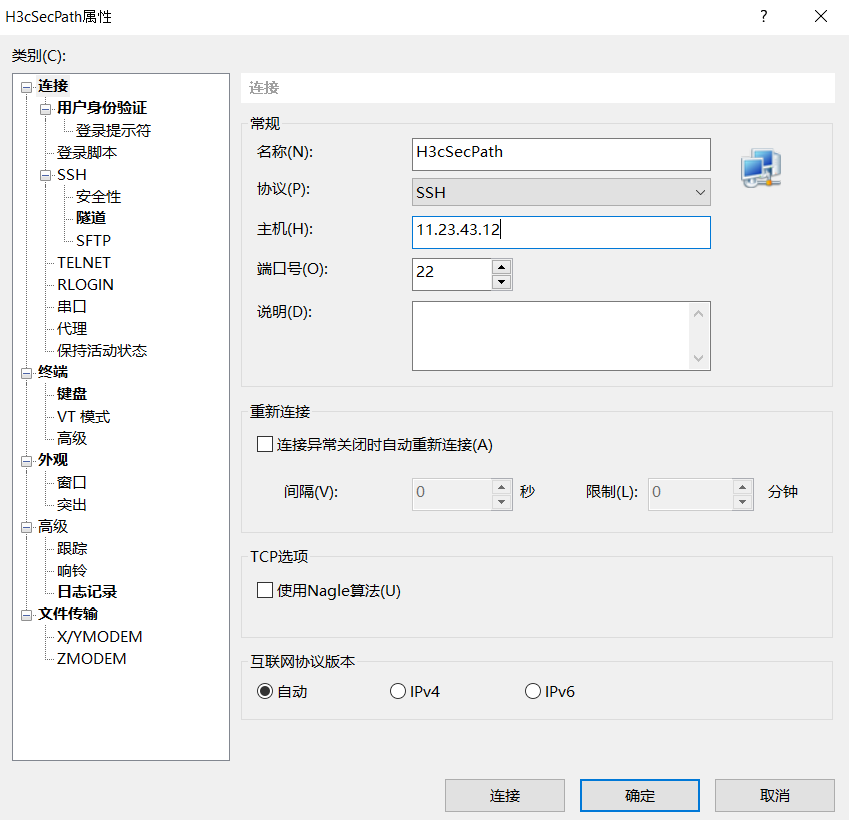
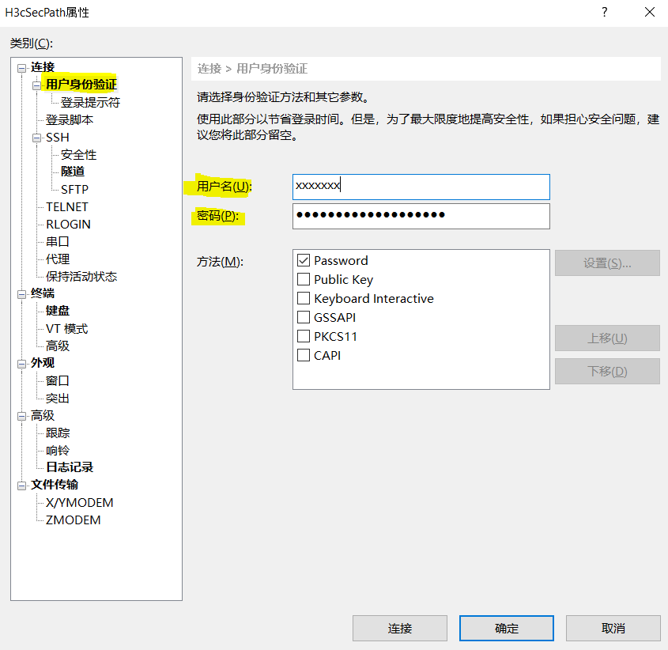
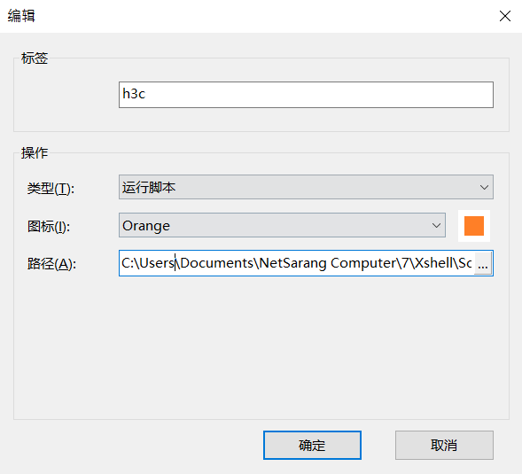
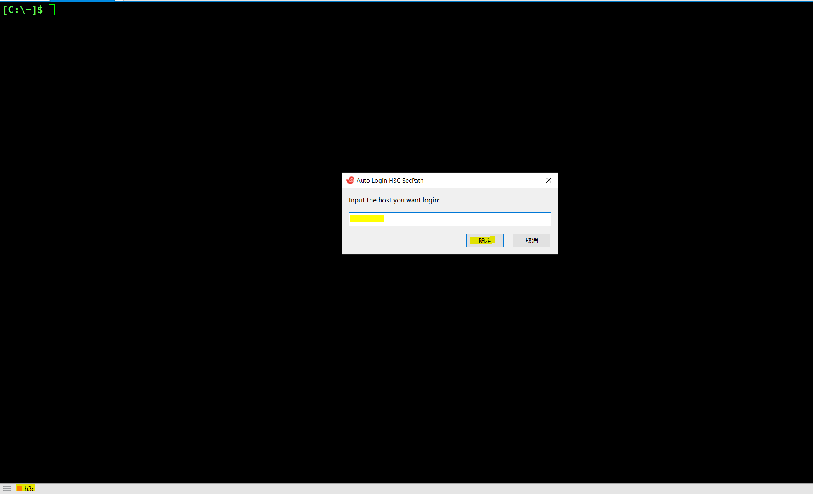

# H3C-SecPath-OTP-Auto-Login
Auto login H3C SecPath OTP, using xshell  
本项目改编自 https://github.com/shenbururen/Xshell-OTP ,感谢大佬贡献！！！  
## 功能
输入任意在本地存储的服务器IP，即可自动登录 **H3C SecPath** 堡垒机跳转到该服务器。  
使用环境：  
windows 系统，xshell 5，xshell 7 均可（xshell 6没有测试）。  
## 使用  
获取 Google Authenticator Secret 放入 js 脚本 Main 函数的 **token** 变量中。若没有 Secret 则无法使用此脚本。  
1. 创建存有服务器IP，密码，用户名的 csv 文件，记录文件路径，放入 js 脚本 Main 函数的   **sshfilepath** 变量中。csv 文件个数如下列表所示。  

| A             | B           | C             |
| :---          |    :----:   |  :---:        |
| 192.168.1.32  | ******      | test          |
| 192.168.1.33  | ******      | helo          |
2. 在 xshell 中创建保存堡垒机会话，根据自己的情况填写身份验证。找到该会话 xsh 文件路径，放入 js 脚本 Main 函数的 **ssessionPath** 变量中。  

  
  

3. 在 xshell 中创建运行脚本按钮。  

4. 在 xshell 新创建一个空白的标签页，点击刚创建的脚本按钮。在弹出的消息框中输入想要登录的服务器IP，即可自动登录。  

